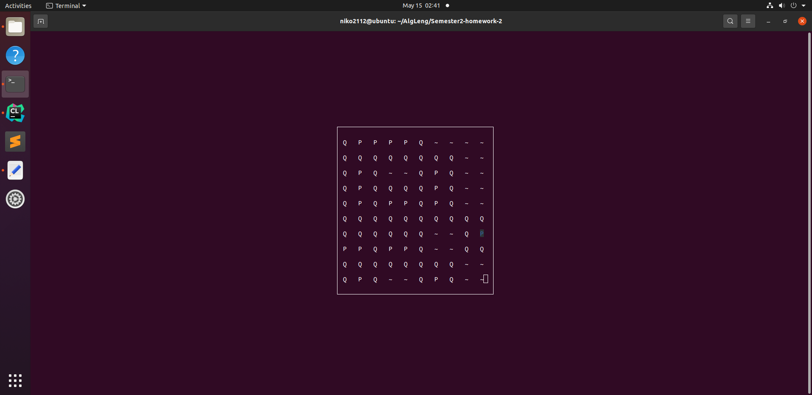

## МОРСКОЙ БОЙ

### INSTALL
sudo apt-get install libncurses5-dev libncursesw5-dev

### BUILD
cmake -H. -B_build

cmake --build _build

_build/demo

#### Расстановка кораблей:
f1 - поставить корабль на место курсора

f2 - поменять расположение корабля (горизонтальное/вертикальное)

#### Игра:

f1 - выстрелить в данную клетку поля

